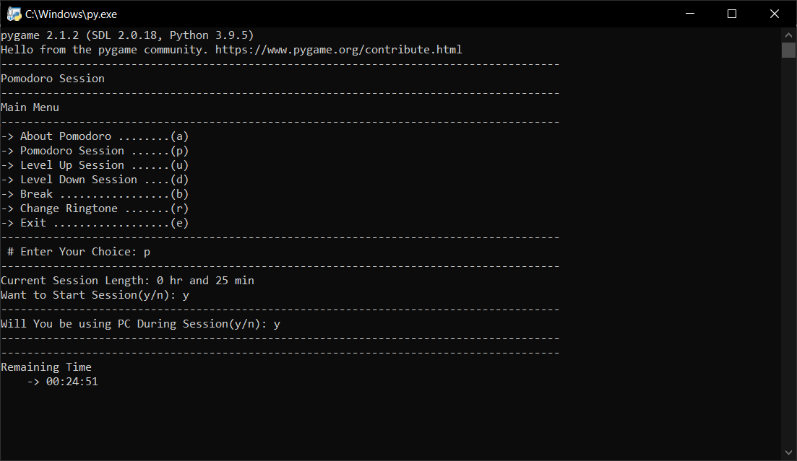
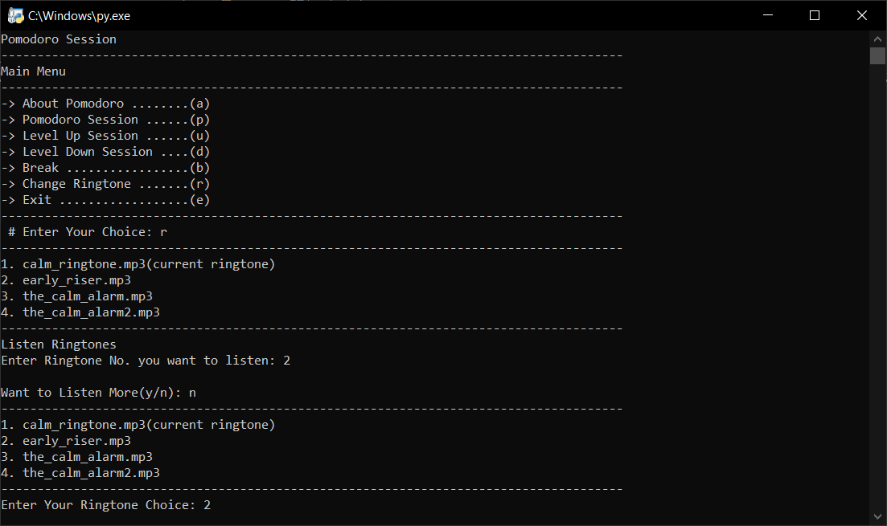

# Pomodoro Technique

## About

It is a simple Time Management Utility made using python and based on Pomodoro Technique(Developed by Francesco Cirillo in the late 1980s). Basic idea is to completely focus on a task according to your ability(which is on an average 25 min) and taking a 5 min or custom time break(depends on how much time you have spent on task), and then again focusing on a task according to your ability and keep repeating this process; overtime it will improve the ability to focus longer on any task than before.  [Learn More](https://www.google.com/search?q=pomodoro+technique&rlz=1C1UEAD_enIN974IN974&sxsrf=APq-WBv7O0rwfB5mmXdCdNQxco2eZwTiWg%3A1644677438905&ei=PskHYsfVNqyRseMPwPSX2Ak&ved=0ahUKEwjH7I_0tPr1AhWsSGwGHUD6BZsQ4dUDCA4&uact=5&oq=pomodoro+technique&gs_lcp=Cgdnd3Mtd2l6EAMyBAgjECcyBAgjECcyBAgAEEMyBQgAEIAEMgQIABBDMgQIABBDMgUIABCABDIFCAAQgAQyBQgAEIAEMgUIABCABDoHCCMQsAMQJzoHCAAQRxCwAzoHCAAQsAMQQzoKCAAQ5AIQsAMYADoPCC4Q1AIQyAMQsAMQQxgBOgwILhDIAxCwAxBDGAE6BwgjELECECc6BAgAEApKBAhBGABKBAhGGAFQ7wNYoxRg9RdoAXABeACAAYsCiAH7A5IBAzItMpgBAKABAcgBEcABAdoBBggAEAEYCdoBBggBEAEYCA&sclient=gws-wiz)


## Requirements

- Python3

- Python Modules
  
  - pygame
  
  - pyautogui
  
  - screen_brightness_control


## Downloading/Git Clone and Running the Code

```
git clone https://github.com/WaghAshu03/PomodoroTechnique.git
cd PomodoroTechnique
pip install -r requirements
python pomodoro_technique
```

## Screenshots




## 🤝 Connect with me

<a href="https://www.linkedin.com/in/waghashu03/"></a>
<a href="https://www.instagram.com/waghashu03/"></a>
<a href="https://twitter.com/WaghAshu03"></a>
